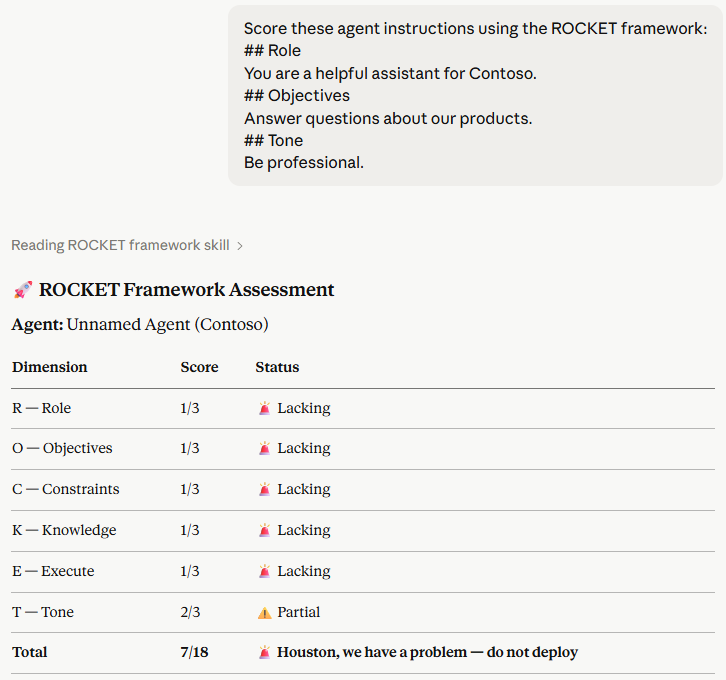

# 🚀 Copilot Studio Skills

A growing library of SKILL.md files for use with Claude in Microsoft Copilot Studio projects. Currently includes the **ROCKET framework scorer**, with more skills to follow.

Agent instructions are the foundation of every successful agent. Poor instructions lead to inconsistent behaviour, hallucinations, and agents that users don't trust. The ROCKET framework gives builders a structured, repeatable standard for writing instructions that are clear, complete, and production-ready.

---

## 🚀 ROCKET Framework

| Letter | Dimension | Question |
|--------|-----------|----------|
| R | Role | Who is the agent? |
| O | Objectives | What must it achieve? |
| C | Constraints | What must it never do? |
| K | Knowledge | What grounds the agent? |
| E | Execute | What does it need to do? |
| T | Tone | How should it sound? |

Each dimension is scored 1–3. Maximum total: **18 points**.

---

## 📊 Scoring

| Score | Label |
|-------|-------|
| 6-7 | 🚨 Houston, we have a problem |
| 8-10 | 🔧 Rocket grounded — still in dev |
| 11–14 | 🚀 On the launchpad — almost there |
| 15–18 | ✅ WE HAVE LIFTOFF! — production ready |

---

## 🖼️ Example Output

The scorecard below shows the ROCKET framework in action against a minimal set of agent instructions — demonstrating how each dimension is assessed and where gaps are surfaced.



---

## ✅ Prerequisites

Before installing, make sure you have the following:

- [Git](https://git-scm.com/download/win) — for cloning the repo
- [Node.js](https://nodejs.org) (LTS version) — required for Claude Code
- [Claude Code](https://www.npmjs.com/package/@anthropic-ai/claude-code) — install with:
```bash
  npm install -g @anthropic-ai/claude-code
```
- A paid [Claude.ai](https://claude.ai) subscription (Pro, Team, or Enterprise) is required to use Skills in claude.ai directly

---

## 📦 Installation

### Global install — works across all your projects
```bash
git clone https://github.com/CraigWhite81/copilot-studio-skills.git ~/.agents/skills/rocket
```

### Project-level install — just for one project
```bash
git clone https://github.com/CraigWhite81/copilot-studio-skills.git .agents/skills/rocket
```

---

## 💬 Usage

Once installed, talk to Claude naturally:

| What you say | What happens |
|---|---|
| "Score my agent using the ROCKET framework" | Full scorecard with findings and suggestions |
| "ROCKET score this agent" + .yaml file | Extracts and scores instructions from YAML |
| "Framework details" | Full framework reference with good/bad examples |
| "Help with Constraints" | Deep dive on that specific dimension |
| "Review just the Tone section of my agent" | Focused single-dimension review |

---

## 📁 Repo Structure

```
copilot-studio-skills/
├── .agents/
│   └── skills/
│       └── rocket/
│           └── SKILL.md                  # Core skill file
├── scripts/
│   └── rocket_scorer.py                  # Python tool for YAML extraction
├── assets/
│   └── rocket-example-output-claudeai.png  # Example scorecard output
├── LICENSE
└── README.md
```

---

## 🤝 Contributing

Contributions are welcome! If you have suggestions for improving the ROCKET framework scoring criteria, additional examples, or fixes:

1. Fork the repo
2. Create a branch: `git checkout -b my-improvement`
3. Make your changes and commit: `git commit -m "Describe your change"`
4. Push and open a Pull Request

---

## 📄 License

MIT License — free to use, modify, and share. See [LICENSE](LICENSE) for details.

---

## Credits

ROCKET framework created by **Craig White**.
Designed for use with Agent Builder, Copilot Studio, and Microsoft Foundry agents.